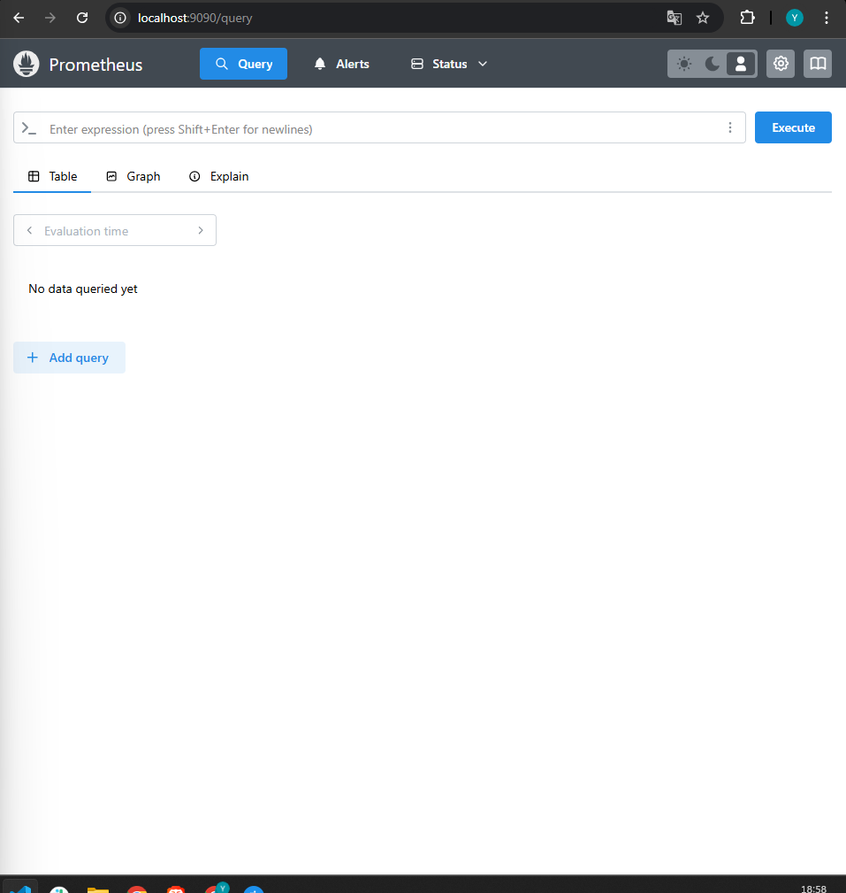
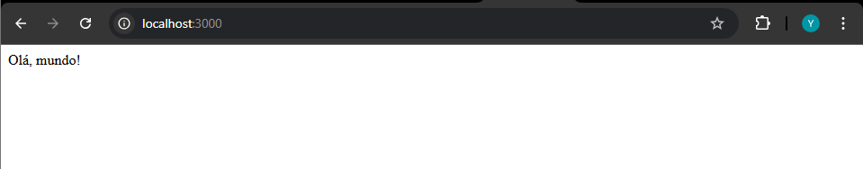

# Ponderada Semana 8 - Yago Araújo

* Aqui iremos fazer um estudo detalhado da parte de métricas com NodeJS e typescript

* o arquivo index.ts terá somente a última versão do código 

* Os tópicos são:

## 1. Visão Geral das Métricas

* Objetivo das métricas: Assim como no ASP.NET Core, o objetivo é monitorar a saúde, desempenho e comportamento do aplicativo, coletando dados sobre a execução.

* Instrumentação: O código registra métricas como o tempo de resposta de requisições HTTP, número de requisições por endpoint, tempo de execução de funções, entre outros.

* Coleta de Métricas: Coleta das métricas usando ferramentas como Prometheus e Grafana.

* Ferramentas: Usar bibliotecas como prom-client para expor as métricas, Prometheus para armazená-las e Grafana para visualizá-las.

## 2. Instrumentação

* Biblioteca de Métricas: Usar bibliotecas como prom-client para instrumentar a aplicação e expor as métricas.

* Exemplo de uso:

```typescript

import express from 'express';
import client from 'prom-client';

const app = express();
const register = client.register;

const httpRequestDurationMicroseconds = new client.Histogram({
  name: 'http_request_duration_seconds',
  help: 'Duration of HTTP requests in seconds',
  buckets: [0.1, 0.3, 0.5, 1, 2, 5]
});

app.get('/metrics', (req, res) => {
  res.set('Content-Type', register.contentType);
  res.end(register.metrics());
});

app.get('/example', (req, res) => {
  const end = httpRequestDurationMicroseconds.startTimer();
  setTimeout(() => {
    end({ status_code: 200 });
    res.send('Example endpoint');
  }, Math.random() * 2000);
});

app.listen(3000, () => {
  console.log('Server running on http://localhost:3000');
});

```
* Explicação: 

- Histogram: Usado para medir a duração das requisições HTTP.

- Endpoint /metrics: Expõe as métricas coletadas para que o Prometheus possa coletá-las.

- Status Code: A métrica é enriquecida com o código de status HTTP de cada requisição.

## 3. Coleta de métricas

* Expondo métricas: As métricas são expostas via um endpoint /metrics (como no exemplo acima).

* Integração com Prometheus: O Prometheus pode ser configurado para buscar essas métricas periodicamente.

* Configuração do Prometheus

- Criar um arquivo prometheus.yml com a configuração de scraping:

```yaml
global:
  scrape_interval: 5s

scrape_configs:
  - job_name: 'node-app'
    static_configs:
      - targets: ['localhost:3000']

```

* Coleta em tempo real: O Prometheus fará chamadas GET ao endpoint /metrics da sua aplicação e coletará as métricas.

## 4. Exemplo prático 

* Expondo múltiplas métricas: Além de histogramas, você pode coletar contagens (client.Counter), medidores (client.Gauge), entre outros, para monitorar diferentes aspectos da aplicação.

* Exemplo de múltiplas métricas:

```typescript

const requestCount = new client.Counter({
  name: 'http_requests_total',
  help: 'Total HTTP requests',
  labelNames: ['method', 'status_code']
});

app.use((req, res, next) => {
  res.on('finish', () => {
    requestCount.inc({ method: req.method, status_code: res.statusCode });
  });
  next();
});

```

## Visualização e Análise

* Grafana: Usar o Grafana para criar dashboards que exibem as métricas coletadas pelo Prometheus. Isso permitirá visualizar o desempenho da aplicação, como o tempo de resposta, número de requisições por segundo, entre outros.

* Configuração do Grafana:

- No Grafana, crie um novo DataSource usando Prometheus como fonte de dados.
- Crie dashboards para monitorar as métricas expostas.

## Exemplo completo com Grafana e Prometheus

* Iremos fazer o exemplo completo utilizando containers do docker e orquestrando com o docker-compose. Basicamente, os containers que nós usaremos serão: a API, que coleta os dados e os containers padrões do grafana e do prometheus. Porém, antes precisa ser criado aquele arquivo padrão do prometheus, o prometheus.yml

* Após rodarmos o comando abaixo, a API estará na porta 3001, o prometheus na 9090 e o grafana na 3001

```bash
docker-compose up -d
```

* Linha de comando


* Prometheus 


* API 


* Grafana


- Agora, iremos entrar no endpoint /metrics para que o prometheus consiga capturas as métricas 

- Após consumir, teremos isso:


- Agora, vamos configurar o grafana. Basta entrar na url dele (http://localhost:3001) e fazer o login com o nome e senha sendo "admin".

- Depois, iremos na parte de adicionar um "data source" e escolhemos o Prometheus,colocando a URL local


- Após isso, criaremos o dashboard e selecionaremos a query configurada na API, nesse caso é a duração das requisições para o nodejs-api


- Agora foi finalizado e temos o dashboard completo !

